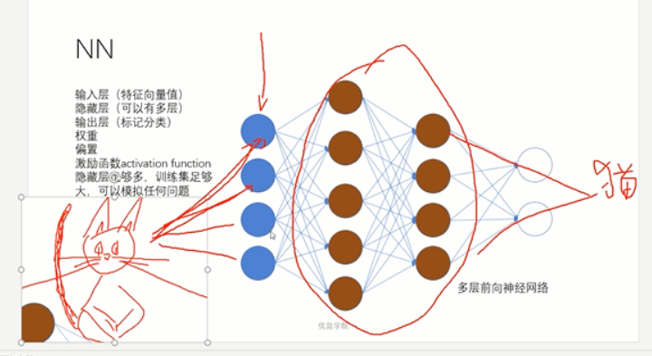

# jiqixuexi
# 一、机器学习
## 概念
		分类、回归、监督学习、非监督学习
## 机器学习步骤
1. 获取数据
	* 获取、清洗、存储(hdfs)
2. 数据拆分训练集和测试集
3. 用特征向量训练算法
4. 在测试集上评估算法
5. 算法迭代与改进
6. 实际应用
7. 获取更多数据
8. ...

##　常用算法
### 监督学习
* 分类
	* KNN（k个nearest neighbors）
			python anocoda python
	* DT(decision Tree)
	* SVN(Surpport vector machine)
	* NN(nerual network) //深度学习基础
	* NB(naive bays)
* 回归
	* LR(linear Regression)
	* NLR(Non-)

### 非监督学习算法
	* K-Means

# 二、神经网络NN入门(neural network)

## 目标
* 了解NN的概念和基本算法
算法比较繁杂
NN 多层前向神经网络

	神经网络算法依赖GPU，要求计算机性能

	神经网络模拟人的概念

